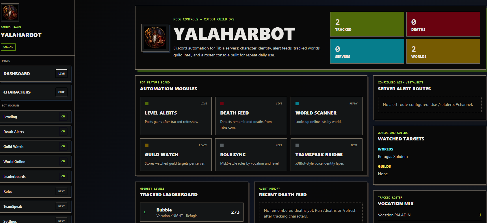

# Tibia Enemy List

This fork turns YalaharBot into a web-first enemy tracker. Configure one Tibia world, add enemy guilds, and run a live scan. The Django API uses the existing `tibia.py` parsers to fetch guild rosters and the world's online list, then the frontend displays the roster members currently online.

## Enemy-list workflow

1. Start the Django backend and Next.js frontend using the setup below.
2. Enter and save a Tibia world.
3. Add one or more enemy guild names.
4. Select **Refresh enemies** to fetch live Tibia data and cross-reference the rosters.

The main endpoints are `/api/enemy-list/config/`, `/api/enemy-guilds/`, and `/api/enemy-list/status/`. The original Discord bot code and APIs remain available for compatibility.

## Original YalaharBot foundation

YalaharBot is a Discord automation bot for Tibia servers, backed by a Django REST API and a Next.js control-panel frontend. It handles character identity, level and death alert feeds, watched worlds/guilds, and a roster console built for repeated daily use.



## Features

- **Discord hybrid commands** — every command works as both a prefix (`!`) and a slash (`/`) command.
- **Character identity** — link Tibia characters to a Discord account and look them up on demand.
- **Level alerts** — a background task refreshes tracked characters every 15 minutes and posts level gains to a configured channel.
- **Death feed** — remembers deaths pulled from Tibia.com and reports new ones.
- **Watched worlds & guilds** — per-server tracking of Tibia worlds and guilds.
- **Leaderboards** — highest tracked levels and recent deaths across the roster.
- **Django REST API** — full CRUD over users, characters, deaths, server settings, and watched targets.
- **Next.js + Tailwind frontend** — control-panel dashboard, character manager, and per-module pages.
- Tibia data via [`tibia.py`](https://tibiapy.readthedocs.io/), environment-based configuration.

## Discord commands

| Command | Description |
| --- | --- |
| `/add <character>` | Link Tibia character(s) to your Discord account (select-menu UI). |
| `/lookup <character>` | Look up a Tibia character. |
| `/mychars` | Show characters linked to your account. |
| `/whois <user>` | Show characters linked to another Discord user. |
| `/refresh` | Refresh your linked characters and report level/death changes. |
| `/deaths <character>` | Show recent remembered deaths for a character. |
| `/setalerts <#channel>` | Set the channel for automatic alerts (requires **Manage Server**). |
| `/watchworld <world>` / `/unwatchworld <world>` | Watch / unwatch a Tibia world (Manage Server). |
| `/watchguild <guild>` / `/unwatchguild <guild>` | Watch / unwatch a Tibia guild (Manage Server). |
| `/watched` | Show watched worlds and guilds for this server. |
| `/online <world>` | Show current online players for a world. |
| `/guild <guild>` | Look up a Tibia guild. |
| `/leaderboard` | Show tracked-character leaderboards. |

## Requirements

- Python 3.12+ (project pins Django 6, discord.py 2.7)
- Node.js and npm (Next.js 16, React 19)
- A Discord bot token — with the **Message Content Intent** enabled in the Discord Developer Portal for prefix commands to work.

## Backend setup

```powershell
python -m venv .venv
.\.venv\Scripts\Activate.ps1
python -m pip install -r requirements.txt
Copy-Item .env.example .env
```

Edit `.env` and replace the placeholder values. The default example uses SQLite for local demo use. To use PostgreSQL, switch the `DB_ENGINE` block in `.env` to the PostgreSQL values shown in `.env.example`.

```powershell
python manage.py migrate
python manage.py runserver
```

The API is served at the project root (e.g. `/api/characters/`, `/api/watched-worlds/`); Django admin lives at `/admin/`.

## Frontend setup

```powershell
cd frontend
npm install
npm run dev
```

To build the frontend for Django to serve:

```powershell
cd frontend
npm run build
cd ..
python manage.py collectstatic
```

Django serves the exported Next.js app from `frontend/out` in `DEBUG` mode and falls back to it for non-API routes.

## Run the Discord bot

Set `DISCORD_BOT_TOKEN` in `.env`, then run:

```powershell
python bot\run_bot.py
```

Set `TEST_GUILD_ID` in `.env` to sync commands to a single test server first (instant), instead of a global sync (can take up to an hour to propagate).

## Tests

```powershell
python manage.py test          # Django / bot backend
cd frontend; npm test          # Vitest frontend
```

## Public repo notes

Do not commit `.env`, local databases, `staticfiles/`, frontend build output, `node_modules/`, or Python bytecode. Use `.env.example` for documented placeholders only.
